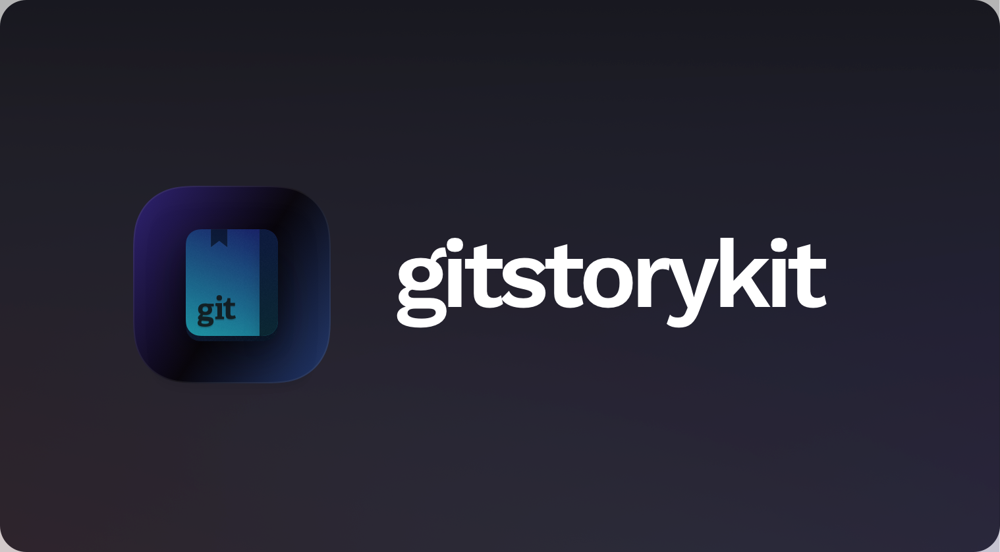

<p align="center"><br>
  <a href="#">
    
  </a>
</p>
<center>
<p align="center">
  
 
 
 
</p>
</center>


GitStoryKit is a little development kit that can be used to develop apps and software that enables git time travel, the library is in early development and is designed for simplicity, it is heavily used in GitStory  


The following Git clients are supported : 
- GitHub ✅
- GitLab ⏳ (on development)

## Usage 

### Initialization 

```js
import GitStory from "gitstorykit";

const gitstory = new GitStory("Github");

gitstory.init({ owner: "vercel", repo: "next.js" }); 

// with auth tokens
gitstory.init({ owner: "vercel", repo: "next.js" , auth: "yourtoken" }); 
```

### Get first commit
```js
const firstcommit = await gitstory.getFirstCommit();
```

### Get first commit Date
```js
const firstcommitdate = await gitstory.getFirstCommitDate();
```

### Get a commit's Date
Dates should be in the **ISO 8601 format**
```js
const commit_date = await gitstory.getCommitDate(commit_sha);
```

### Get commit between dates

Dates should be in the **ISO 8601 format**
```js
const commit = await gitstory.getCommitsBetweenDates(startDate, endDate, per_page: number, page: number);
```

### Get commits until date

Dates should be in the **ISO 8601 format**
```js
const commit = await gitstory.getCommitsUntilDate(date, per_page: number, page: number);
```

### Get a repository active years 
```js
const active_years = await gitstory.yearsActive();
```

## Contributing
To contribute or understand the code structure,
please see our [contributing.md](/CONTRIBUTING.md).

## Authors

Badr B. ([@swve](https://github.com/swve))
